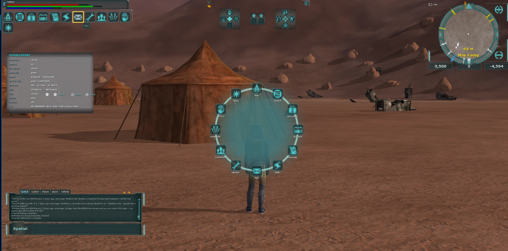
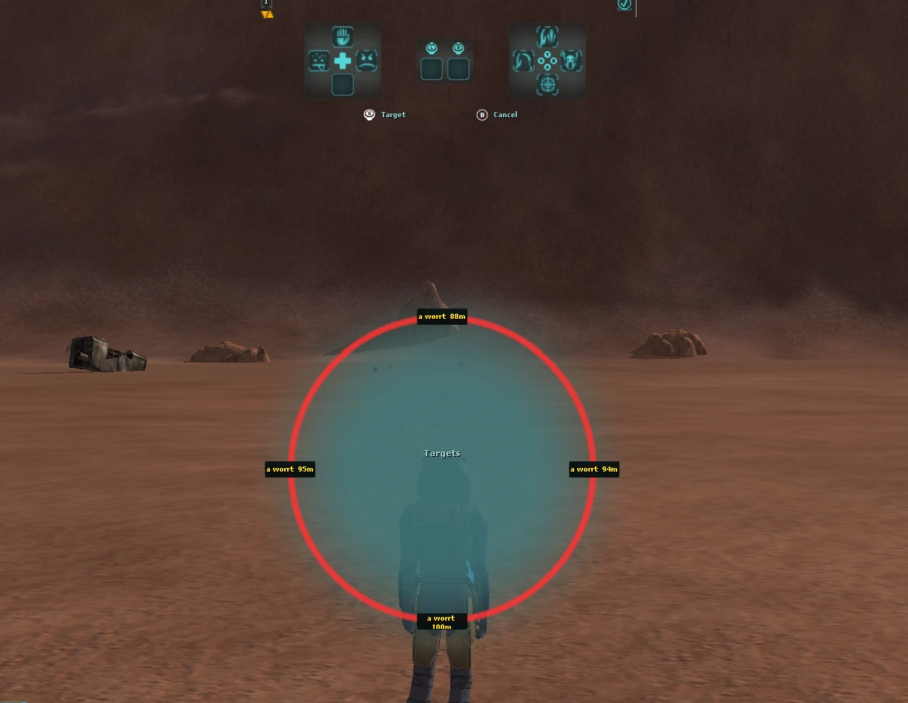
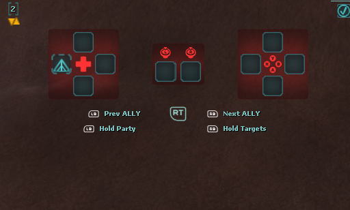
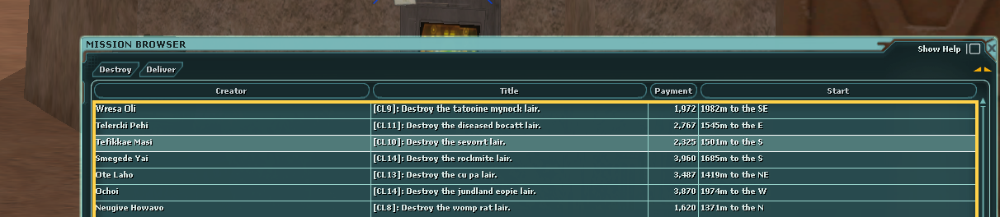
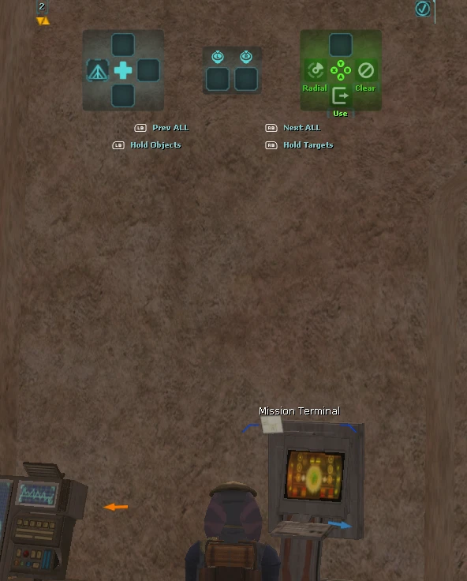
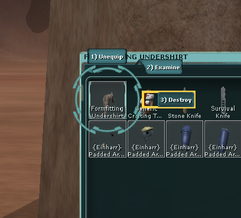
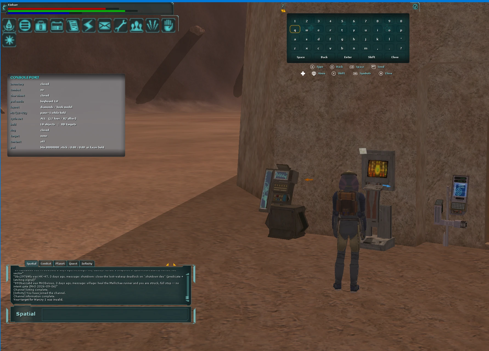

# ConsolePort for SWG Infinity - review package

A gamepad interface in the spirit of [WoW ConsolePort](https://github.com/seblindfors/ConsolePort)
for the Star Wars Galaxies client on the Infinity emulator (`swgemu.exe`
stage.119798, md5 `d84ee5565c24420858972edda9dddbf4`). A crossbar of two diamonds
on the stock toolbar, a UI cursor for any window, radial menus, targeting on the
bumpers, an on-screen keyboard - all of it through the client's real widgets,
with no renderer of our own.

Assembled 10 Sep 2026. Everything is here: the sources, the finished build, the
files that go into the client, the test rig, the generators, the documentation.

## Screenshots

| Game menu radial | Target ring |
|---|---|
|  |  |
| **Controller hints and ally cycling** | **Mission browser** |
|  |  |
| **Object cycling at a terminal** | **Inventory context radial** |
|  |  |
| **On-screen keyboard** | |
|  | |

## Status: a working prototype, playable, but not shipped

What exists:

- **11,238 lines** of module plus **3,783** lines of tests; **132 tests, 1989
  checks, 0 failures** - the run is included:
  [`build/tests-2026-09-10.txt`](build/tests-2026-09-10.txt);
- **on the evening of 9 Sep 2026 everything finished was run on the live Test
  Center client with a real DualSense**: the crossbar and its flyouts, the desktop
  over any window, the game menu radial, the crosshair and the target ring, the NPC
  interaction layer, the camera on the right stick, native HID input. The project
  owner's verdict: "fine both visually and in gameplay", playable - the shots are in
  [`docs/screenshots/`](docs/screenshots/);
- on 10 Sep came the on-screen keyboard, colors from the client's active theme and
  dropdown lists under the pad;
- the integration surface with QoL is defined and small: five functions plus two
  hooks.

What is missing - and why this is still a prototype:

1. **The target form of delivery has never been built.** Everything lives through
   the test-rig injection (`harness/inject.py` + `build/cpinject.dll`), and
   Sentinel honestly reports `DLL_INJECTION`. The module inside the QoL DLL is the
   single biggest unproven step.
2. **The ABI is nailed to one client build**: 38 addresses with signatures and the
   exe md5. On a mismatch `cp::install` refuses to work at all - there is no
   partial degradation.
3. **The settings are a developer's.** One `consoleport.ini` mixes working keys
   with rig knobs. There is no settings window and no hot layout switching.
4. **Verification is manual.** The tests exercise the logic on mocks; a repeatable
   in-game regression pass does not exist.
5. Smaller things: `cp::onKey` is declared but called by nobody in the rig; on
   filled slots the stock keyboard labels still sit on top of the diamonds.

What would move this into alpha, in order: build `consoleport.lib` into the QoL
DLL and run it without the injection -> a settings window and hot layouts -> a
procedure for regenerating the ABI with a soft refusal instead of a total one ->
wire up `onKey` and the chat-focus safeguard.

## Where to start reading

| # | Document | About |
|---|---|---|
| 1 | [`docs/01-module.md`](docs/01-module.md) | what the module does and does not do; **the integration point with QoL** - start here |
| 2 | [`docs/02-hooks.md`](docs/02-hooks.md) | all four hooks: the target, the justification, the side effects; QoL's own hooks; what may be needed next |
| 3 | [`docs/03-abi.md`](docs/03-abi.md) | 38 functions, globals, vtables, offsets - every row with the evidence it was taken from |
| 4 | [`docs/04-run-and-build.md`](docs/04-run-and-build.md) | how to install, run, build and regenerate; the rig's pitfalls |
| - | [`docs/screenshots/`](docs/screenshots/) | seven shots off the live client: the radial, the target ring, the hints, the mission browser, the context menu, the keyboard |

If time is short: `01-module.md`, then the "Integration point" section, then
`02-hooks.md`.

## Map of the package

| Directory | What is in it |
|---|---|
| [`src/consoleport/`](src/consoleport/) | **the module itself.** `abi/` (addresses, properties), `core/` (calls into the binary, the UI tree, gestures, the runtime, the hooks), `input/` (the pad, DualSense HID, XInput), `crossbar/` (flyout geometry), `cursor/` (nodes, navigation, hints, the window stack), `windows/` (the desktop, the inventory, popups, the menu radial, the keyboard, bindings, the character selection screen), `world/` (targets, rings, decor), `tests/`, `gen/`, `build.cmd` |
| [`src/inject/`](src/inject/) | the test-rig wrapper: bringing the module into a live process, the frame tick, the input hook, native HID, the crash catcher |
| [`build/`](build/) | the finished build: `cpinject.dll` (the rig), `consoleport.lib` (for linking into QoL), `cp_tests.exe`, the test run |
| [`client-files/`](client-files/) | what goes into the client: the markup, the input maps, the textures, a commented `consoleport.ini` and `deploy.py` |
| [`harness/`](harness/) | the test rig: `inject.py` (bringing the DLL in), `patch_joy.py` (the saturation guard), the DirectInput and HID probes, the XInput probe, the screenshot and click helpers |
| [`tools/`](tools/) | the generators: `abitable.py` (the ABI from the exe), `gen_props.py`, `gen_profiles.py`, `layout.py` (the layout), `build.py` (input maps), `diamond.py` (markup), `glyphs.py`/`ringtex.py` (textures), `abigen.py` (the disassembler), the validators |
| [`stock/`](stock/) | the stock files the generators actually read, extracted from the `.tre`: the `input/*.iff` bases, the `ui/*.inc` the shipped markup is patched from, the input maps as text - the originals to diff against |
| [`assets/`](assets/) | the source of the glyph atlas (Kenney Input Prompts 1.5, CC0) |
| [`reference/`](reference/) | a map of the two external repositories (the client sources, ConsolePort) - they themselves were not copied, 1.5 GB |

217 files, 16 MB.

## Quick start

Python 3.11, and `pip install pefile` - `harness/inject.py` needs it. Nothing else
is needed for a run; the generators additionally want `Pillow` (the textures) and
`capstone` (the disassembler).

With the client closed:

```
python client-files/deploy.py --game "E:\Games\SWG\Dev\SWG Infinity\Test Center"
```

Then:

```
python harness/patch_joy.py 2400              # the guard: removes the FATAL on DualSense saturation
launcher -> Play
python harness/inject.py build/cpinject.dll   # brings the module into the live process
```

What to watch: `<client directory>\consoleport.log`, the status line every 600
frames: `installed=1 abi=1 crossbar=1 packHooked=1`.

Rebuilding (needs MSVC x86, `vcvars32.bat` from VS2022):

```
src\consoleport\build.cmd        # the tests
src\consoleport\build.cmd lib    # consoleport.lib for QoL
src\inject\build.cmd             # cpinject.dll
```

Details, pitfalls and artifact regeneration are in
[`docs/04-run-and-build.md`](docs/04-run-and-build.md).

**One caveat before a run:** the markup in this package is newer than what was
installed in the client when it was assembled (a 9 Sep copy is there).
`deploy.py` has to be run, or part of the debug information will not show.

## What is needed from Infinity

The minimum, which is what the package was assembled for. The module **patches
nothing itself** - there is not a single `VirtualProtect` or
`WriteProcessMemory` anywhere in `src/consoleport/`:

```cpp
#include "consoleport/core/runtime.h"

cp::Config cfg;                  // from [consoleport] in infinity_qol.ini
cfg.hooks.create = ...;          // your MinHook: create(target, detour, &original)
cfg.hooks.remove = ...;
cp::install(cfg);                // false + cp::status().error if the ABI did not match

cp::onFrame();                                     // from your runGameLoopOnce hook
cp::onDeviceData(dev, buf, count, cap, peek);      // from your hook_DI_GetDeviceData
cp::onDeviceLost(dev);
if (cp::onKey(scancode, down)) { /* do not pass it to the client */ }
cp::uninstall();
```

Both hooks the module needs (`runGameLoopOnce`, `GetDeviceData`) QoL already has.
The module asks for two more - `UIVolumePage::Pack` and
`SwgCuiToolbar::getToolbarItem` - and the justification for each is in
[`docs/02-hooks.md`](docs/02-hooks.md). Nothing else.

## The boundaries observed throughout the work

- Test Center only, Live was never touched;
- the client is started only through the launcher, with the `anticheat` directory
  next to it;
- no automation, no timings, no action queues; nothing is changed in what the
  client sends the server; no state hidden from the player is revealed;
- there is no separate binary or loader in the shipped form - the hooks go in as a
  patch to the QoL sources, with review;
- the anti-cheat was not and is not bypassed. The test-rig injection is something
  Sentinel sees and reports - that is by design.
